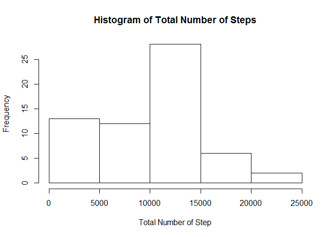
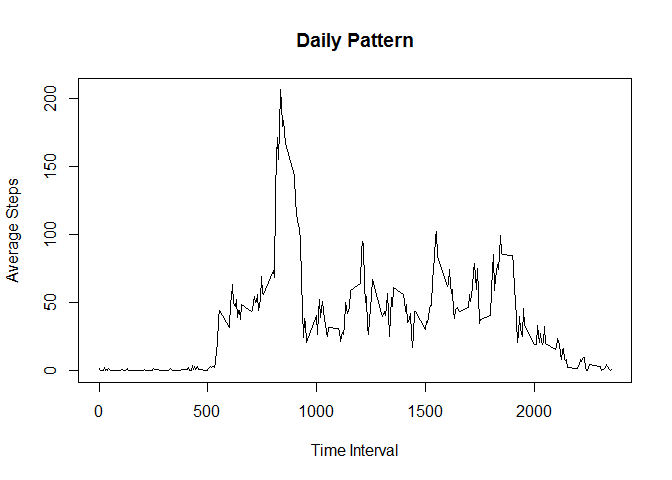
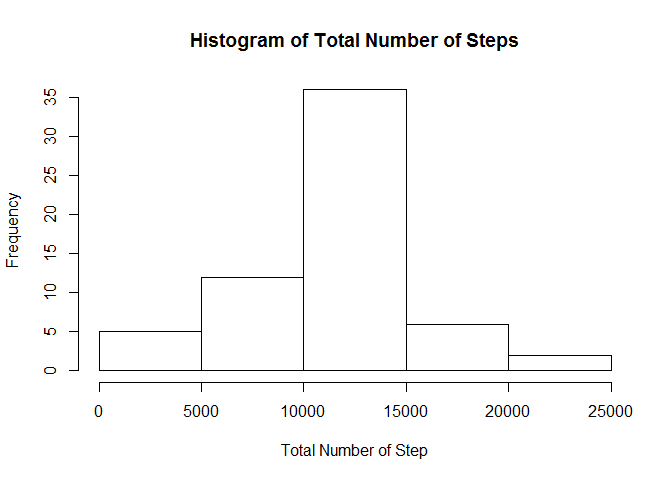
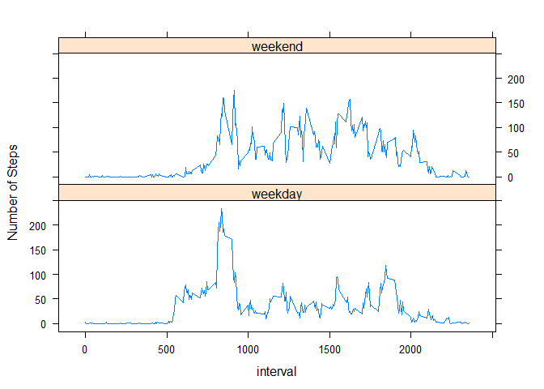

# Reproducible Research: Peer Assessment 1

## Loading and preprocessing the data


```r
library(dplyr)
```

```
## 
## Attaching package: 'dplyr'
## 
## The following objects are masked from 'package:stats':
## 
##     filter, lag
## 
## The following objects are masked from 'package:base':
## 
##     intersect, setdiff, setequal, union
```


```r
setwd("H:/DataScienceCoursera")
act <- read.csv("activity.csv")
TotalNum_date <- group_by(act, date)
head(act)
```

```
##   steps       date interval
## 1    NA 2012-10-01        0
## 2    NA 2012-10-01        5
## 3    NA 2012-10-01       10
## 4    NA 2012-10-01       15
## 5    NA 2012-10-01       20
## 6    NA 2012-10-01       25
```

## What is mean total number of steps taken per day?

**1. Calculate the total number of steps taken per day**

```r
TotalNum_date <- summarize(TotalNum_date, sum = sum(steps,na.rm = T))
TotalNum_date
```

```
## Source: local data frame [61 x 2]
## 
##          date   sum
## 1  2012-10-01     0
## 2  2012-10-02   126
## 3  2012-10-03 11352
## 4  2012-10-04 12116
## 5  2012-10-05 13294
## 6  2012-10-06 15420
## 7  2012-10-07 11015
## 8  2012-10-08     0
## 9  2012-10-09 12811
## 10 2012-10-10  9900
## ..        ...   ...
```

**2. Make a histogram of the total number of steps taken each day**


```r
hist(TotalNum_date$sum,main="Histogram of Total Number of Steps",xlab="Total Number of Step")
```

 

**3. Calculate and report the mean and median of the total number of steps taken per day**

```r
mean = mean(TotalNum_date$sum, na.rm = T)
median = median(TotalNum_date$sum, na.rm = T)
paste("The mean of the total number of steps taken per day is",round(mean,2),",and the median is",median)
```

```
## [1] "The mean of the total number of steps taken per day is 9354.23 ,and the median is 10395"
```

## What is the average daily activity pattern?

**1. Make a time series plot of the 5-minute interval (x-axis) and the average number of steps taken, averaged across all days (y-axis)**


```r
act_interval <- group_by(act, interval)
act_interval <- summarize(act_interval, interval_mean = mean(steps,na.rm = T))
plot(act_interval$interval,act_interval$interval_mean,type="l",main = "Daily Pattern",xlab = "Time Interval",ylab = "Average Steps")
```

 

**2. Which 5-minute interval, on average across all the days in the dataset, contains the maximum number of steps?**


```r
act_interval[act_interval$interval_mean == max(act_interval$interval_mean),]
```

```
## Source: local data frame [1 x 2]
## 
##   interval interval_mean
## 1      835      206.1698
```

## Imputing missing values

**1. Calculate and report the total number of missing values in the dataset**

```r
sum(is.na(act$steps))
```

```
## [1] 2304
```

**2. Devise a strategy for filling in all of the missing values in the dataset.**
The strategy used here is to replace NAs values with the mean for that 5-minute interval.


```r
means <- c()
for (i in 1:nrow(act)){
     if (is.na(act$steps[i])){
          means <- c(means,act_interval$interval_mean[act_interval$interval == act$interval[i]])
     }
     else{
          means <- c(means,act$steps[i])
     }
}

filled <- mutate(act, steps = means)
```

**3. Create a new dataset that is equal to the original dataset but with the missing data filled in.**

```r
head(filled)
```

```
##       steps       date interval
## 1 1.7169811 2012-10-01        0
## 2 0.3396226 2012-10-01        5
## 3 0.1320755 2012-10-01       10
## 4 0.1509434 2012-10-01       15
## 5 0.0754717 2012-10-01       20
## 6 2.0943396 2012-10-01       25
```

**4. Make a histogram of the total number of steps taken each day and Calculate and report the mean and median total number of steps taken per day. Do these values differ from the estimates from the first part of the assignment? What is the impact of imputing missing data on the estimates of the total daily number of steps?**


```r
TotalNum_filled <- group_by(filled, date)
TotalNum_filled <- summarize(TotalNum_filled, sum = sum(steps,na.rm = T))
hist(TotalNum_filled$sum,main="Histogram of Total Number of Steps",xlab="Total Number of Step")
```

 

```r
mean_filled = mean(TotalNum_filled$sum, na.rm = T)
median_filled = median(TotalNum_filled$sum, na.rm = T)
writeLines(paste("Mean without missing values:",round(mean_filled,2),"; Mean with missing values:",round(mean,2),"\nMedian without missing values:",round(median_filled,2),"; Median with missing values:",round(median,2)))
```

```
## Mean without missing values: 10766.19 ; Mean with missing values: 9354.23 
## Median without missing values: 10766.19 ; Median with missing values: 10395
```

These values do differ from the estimates from the first part of the assignment. In the first part, the mean is 9354.23 and the median 10395. In this part, the mean and median are both 10766.19.

The impact of imputing missing data on the estimates is that by replacing the NAs with the mean for 5-minute interval, the mean and median become bigger. We also forced the estimates of 5-minute values move towards the mean of the initial 5-minute values.

## Are there differences in activity patterns between weekdays and weekends?

**1. Create a new factor variable in the dataset with two levels - "weekday" and "weekend" indicating whether a given date is a weekday or weekend day.**


```r
weekday <- function(aString){
     if (weekdays(as.Date(aString)) %in% c("Saturday","Sunday")){
          "weekend"
     }
     else{
          "weekday"
     }
}
act_interval_date <- mutate(act, weekday_weekend = factor(sapply(date,FUN=weekday)))
head(act_interval_date)
```

```
##   steps       date interval weekday_weekend
## 1    NA 2012-10-01        0         weekday
## 2    NA 2012-10-01        5         weekday
## 3    NA 2012-10-01       10         weekday
## 4    NA 2012-10-01       15         weekday
## 5    NA 2012-10-01       20         weekday
## 6    NA 2012-10-01       25         weekday
```

**2. Make a panel plot containing a time series plot (i.e. type = "l") of the 5-minute interval (x-axis) and the average number of steps taken, averaged across all weekday days or weekend days (y-axis).**


```r
library(lattice)
act_interval_date <- group_by(act_interval_date, weekday_weekend,interval)
act_interval_date <- summarize(act_interval_date, interval_mean = mean(steps,na.rm = T))
xyplot(interval_mean ~ interval | weekday_weekend,data = act_interval_date,layout = c(1,2),type = "l",ylab = "Number of Steps")
```

 

